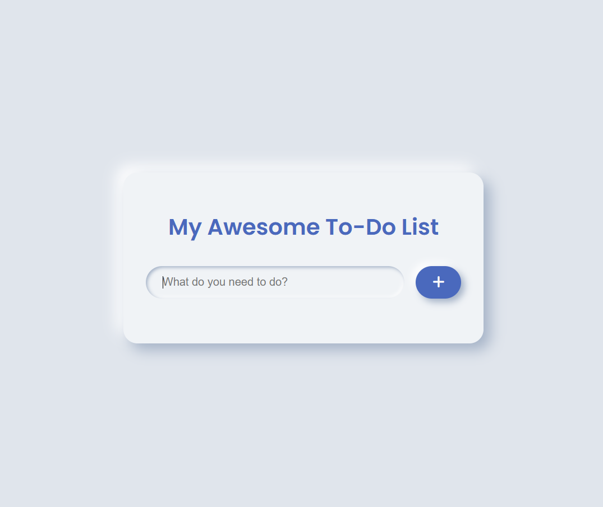

## My-Awesome-To-Do-List
A sleek, stylish, and intuitive to-do list web application built with vanilla HTML, CSS, and JavaScript. This project focuses on providing a great user experience with a clean design, smooth animations, and persistent data storage.

✨ Features
Add Tasks: Quickly add new tasks to your list via a clean input field.

Mark as Complete: Simply click on a task to toggle its completion status, visually distinguishing it with a strikethrough.

Delete Tasks: Remove tasks you no longer need with a single click on the delete icon.

Persistent Storage: Your tasks are automatically saved to your browser's local storage. This means your to-do list will be waiting for you even after you close the browser or restart your computer.

Modern & Responsive Design: A beautiful, minimalist, and slightly neumorphic design that looks great on both desktop and mobile devices.

Interactive UI: Smooth animations and hover effects provide satisfying visual feedback.

Built with Web Fundamentals: No frameworks or libraries needed! This project is a pure demonstration of the power of HTML, CSS, and JavaScript.

💻 Technologies Used
This project is built using core web technologies:

HTML5: For the structure and markup of the application.

CSS3: For styling, layout (Flexbox), animations, and the responsive design.

JavaScript (ES6+): For the application logic, DOM manipulation, event handling, and interaction with Local Storage.

Font Awesome: For scalable vector icons.
